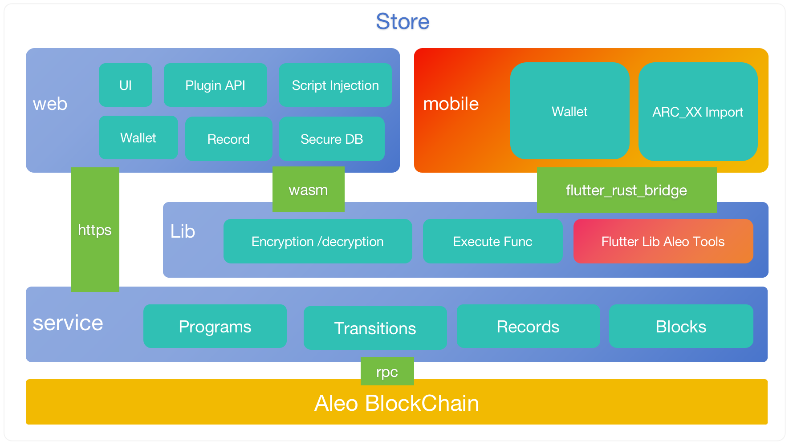

# Soter|Aleo Wallet Browser Plugin

[Update Logs](./update_log)

[Tutorials](./tutorials)

## Introduction

A safe and fast Chrome extention wallet for Aleo blockchain.

A digital crypto wallet for Aleo blockchain ; Providing users with services such as creating wallet accounts, counting Aleo points, collecting sparse records, displaying interactive information, transferring Aleo points, aggregation etc. It provides transaction packaging, contract execution, record query, message signature and verification services for contract developers.

## System Design

## Download

[soter-aleo-wallet](https://chromewebstore.google.com/detail/soter-aleo-wallet/gkodhkbmiflnmkipcmlhhgadebbeijhh)
